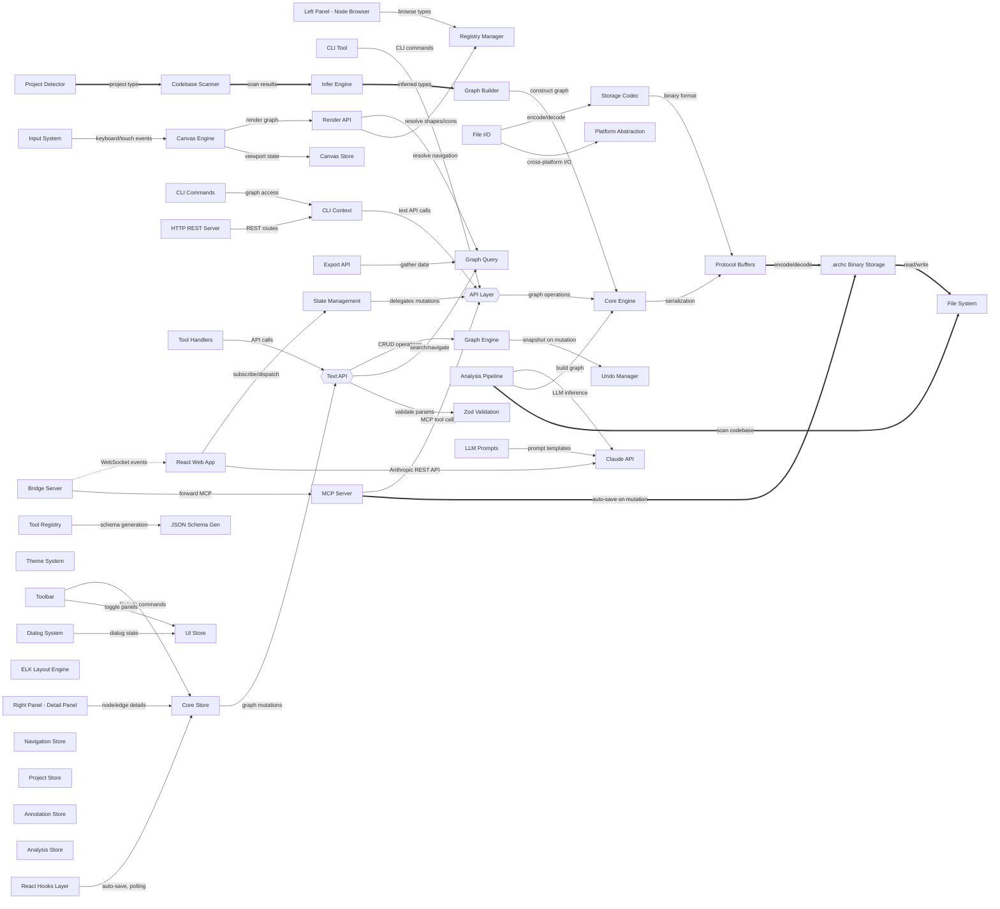

# ArchCanvas

> Auto-generated by ArchCanvas

## Overview

| Metric | Count |
|--------|-------|
| Nodes  | 50 |
| Edges  | 45 |
| Owners | 0 |

## Components

### React Web App

- **Type:** `compute/service`
- **Notes:** 1

  #### Canvas Engine

  - **Type:** `compute/service`
  - **Notes:** 1

  #### Toolbar

  - **Type:** `compute/function`

  #### Left Panel - Node Browser

  - **Type:** `compute/function`

  #### Right Panel - Detail Panel

  - **Type:** `compute/function`

  #### Dialog System

  - **Type:** `compute/function`

  #### React Hooks Layer

  - **Type:** `compute/function`

  #### Theme System

  - **Type:** `compute/function`

### CLI Tool

- **Type:** `compute/service`
- **Notes:** 1

  #### CLI Commands

  - **Type:** `compute/function`

  #### HTTP REST Server

  - **Type:** `compute/service`

  #### CLI Context

  - **Type:** `compute/function`

### MCP Server

- **Type:** `compute/service`
- **Notes:** 1

  #### Tool Registry

  - **Type:** `compute/function`

  #### Tool Handlers

  - **Type:** `compute/function`

  #### JSON Schema Gen

  - **Type:** `compute/function`

### Bridge Server

- **Type:** `compute/service`
- **Notes:** 1

### Core Engine

- **Type:** `compute/service`

  #### Graph Engine

  - **Type:** `compute/function`
  - **Notes:** 1

  #### Graph Query

  - **Type:** `compute/function`

  #### Storage Codec

  - **Type:** `compute/function`
  - **Notes:** 1

  #### File I/O

  - **Type:** `compute/function`

  #### Registry Manager

  - **Type:** `data/repository`

  #### Undo Manager

  - **Type:** `compute/function`

  #### ELK Layout Engine

  - **Type:** `compute/function`

  #### Platform Abstraction

  - **Type:** `compute/function`

  #### Input System

  - **Type:** `compute/function`

### API Layer

- **Type:** `compute/api-gateway`

  #### Text API

  - **Type:** `compute/api-gateway`
  - **Notes:** 1

  #### Render API

  - **Type:** `compute/function`
  - **Notes:** 1

  #### Export API

  - **Type:** `compute/function`
  - **Notes:** 1

  #### Zod Validation

  - **Type:** `compute/function`

### State Management

- **Type:** `compute/service`

  #### Core Store

  - **Type:** `compute/function`
  - **Notes:** 1

  #### Canvas Store

  - **Type:** `compute/function`

  #### UI Store

  - **Type:** `compute/function`

  #### Navigation Store

  - **Type:** `compute/function`

  #### Project Store

  - **Type:** `compute/function`

  #### Annotation Store

  - **Type:** `compute/function`

  #### Analysis Store

  - **Type:** `compute/function`

### Analysis Pipeline

- **Type:** `compute/service`
- **Notes:** 1

  #### Project Detector

  - **Type:** `compute/function`

  #### Codebase Scanner

  - **Type:** `compute/function`

  #### Graph Builder

  - **Type:** `compute/function`

  #### Infer Engine

  - **Type:** `compute/function`

  #### LLM Prompts

  - **Type:** `compute/function`

### .archc Binary Storage

- **Type:** `data/object-storage`

### File System

- **Type:** `data/object-storage`

### Claude API

- **Type:** `compute/service`

### Protocol Buffers

- **Type:** `compute/function`
- **Notes:** 1

## Connections

- `01KK8Y40C5MSZP7QAYSXMNX5B5` → `01KK8Y48GWBVCVBBVZMY8GGVS2` [sync] — "subscribe/dispatch"
- `01KK8Y48GWBVCVBBVZMY8GGVS2` → `01KK8Y488JM5W8PZ3TK963ES4E` [sync] — "delegates mutations"
- `01KK8Y488JM5W8PZ3TK963ES4E` → `01KK8Y46V6G7651QWJHEDSX68A` [sync] — "graph operations"
- `01KK8Y46V6G7651QWJHEDSX68A` → `01KK8Y4EC7BX2WYXD8HTHEQ3YA` [sync] — "serialization"
- `01KK8Y4EC7BX2WYXD8HTHEQ3YA` → `01KK8Y4D1RSJT579F9YTH46ZGT` [data-flow] — "encode/decode"
- `01KK8Y4D1RSJT579F9YTH46ZGT` → `01KK8Y4DN9WGAE2FQMN15H3BWR` [data-flow] — "read/write"
- `01KK8Y40XKJNKA421EPE1NNVK2` → `01KK8Y488JM5W8PZ3TK963ES4E` [sync] — "CLI commands"
- `01KK8Y41F4TT171AY4079TNA3H` → `01KK8Y488JM5W8PZ3TK963ES4E` [sync] — "MCP tool calls"
- `01KK8Y424PN87HKY0EXD6SRQXF` → `01KK8Y40C5MSZP7QAYSXMNX5B5` [async] — "WebSocket events"
- `01KK8Y424PN87HKY0EXD6SRQXF` → `01KK8Y41F4TT171AY4079TNA3H` [sync] — "forward MCP"
- `01KK8Y40C5MSZP7QAYSXMNX5B5` → `01KK8Y4DWXJC0VGVKS2PNPWS7P` [sync] — "Anthropic REST API"
- `01KK8Y492FM0CV4TPAC6FXGP8S` → `01KK8Y4DWXJC0VGVKS2PNPWS7P` [sync] — "LLM inference"
- `01KK8Y492FM0CV4TPAC6FXGP8S` → `01KK8Y46V6G7651QWJHEDSX68A` [sync] — "build graph"
- `01KK8Y492FM0CV4TPAC6FXGP8S` → `01KK8Y4DN9WGAE2FQMN15H3BWR` [data-flow] — "scan codebase"
- `01KK8Y56NHK1WD3YSX795CEV25` → `01KK8Y5WEJ0FE58C11213KVZBG` [sync] — "render graph"
- `01KK8Y56NHK1WD3YSX795CEV25` → `01KK8Y5T8PJDEDTAYMHK02WH4J` [sync] — "viewport state"
- `01KK8Y56RDC5S6V07HWTYS40X4` → `01KK8Y5T5XZE3BE8NEYNKXEP9K` [sync] — "file/edit commands"
- `01KK8Y56RDC5S6V07HWTYS40X4` → `01KK8Y5TBFHGRVNZXF7HSJCTWC` [sync] — "toggle panels"
- `01KK8Y56Y4SA34MZPH913VYB5Z` → `01KK8Y5T5XZE3BE8NEYNKXEP9K` [sync] — "node/edge details"
- `01KK8Y56V7QBT3Q8V4QWYC4WDC` → `01KK8Y62Y0T0DRSRED3X0MC3N4` [sync] — "browse types"
- `01KK8Y5710VCQQ8YYV9Z5WZH2F` → `01KK8Y5TBFHGRVNZXF7HSJCTWC` [sync] — "dialog state"
- `01KK8Y573YKYMCZ0CTCQTJC2Q4` → `01KK8Y5T5XZE3BE8NEYNKXEP9K` [sync] — "auto-save, polling"
- `01KK8Y5WBR59YCC63HMNAQEMWY` → `01KK8Y62JCTE8J0Y88NKD32J0R` [sync] — "CRUD operations"
- `01KK8Y5WBR59YCC63HMNAQEMWY` → `01KK8Y62NEM2P310N2DHCXC4SN` [sync] — "search/navigate"
- `01KK8Y5WBR59YCC63HMNAQEMWY` → `01KK8Y5WM5CFD3QHT77X1R1ZG7` [sync] — "validate params"
- `01KK8Y5WEJ0FE58C11213KVZBG` → `01KK8Y62NEM2P310N2DHCXC4SN` [sync] — "resolve navigation"
- `01KK8Y5WEJ0FE58C11213KVZBG` → `01KK8Y62Y0T0DRSRED3X0MC3N4` [sync] — "resolve shapes/icons"
- `01KK8Y5WHA42QHJW4B5JNHAMMH` → `01KK8Y62NEM2P310N2DHCXC4SN` [sync] — "gather data"
- `01KK8Y62JCTE8J0Y88NKD32J0R` → `01KK8Y630WRX4HARV02R9736D2` [sync] — "snapshot on mutation"
- `01KK8Y62R7W1EHVSKN4C4PK96G` → `01KK8Y4EC7BX2WYXD8HTHEQ3YA` [sync] — "binary format"
- `01KK8Y62V48F7F1KEBADBW4A3B` → `01KK8Y62R7W1EHVSKN4C4PK96G` [sync] — "encode/decode"
- `01KK8Y62V48F7F1KEBADBW4A3B` → `01KK8Y63836KW129CXV6ZBVFTR` [sync] — "cross-platform I/O"
- `01KK8Y63BC7B25WBY4A7DEWM6Q` → `01KK8Y56NHK1WD3YSX795CEV25` [sync] — "keyboard/touch events"
- `01KK8Y65BT6H19MJTHH6RQ71VS` → `01KK8Y65HWA3K7XPZY4JPJ6PT8` [sync] — "graph access"
- `01KK8Y65HWA3K7XPZY4JPJ6PT8` → `01KK8Y488JM5W8PZ3TK963ES4E` [sync] — "text API calls"
- `01KK8Y65ER9X58JFC6QCM1GZ0K` → `01KK8Y65HWA3K7XPZY4JPJ6PT8` [sync] — "REST routes"
- `01KK8Y68832QCSRY7S9WSQ978F` → `01KK8Y5WBR59YCC63HMNAQEMWY` [sync] — "API calls"
- `01KK8Y6854EQPMMKX6WCG03SPR` → `01KK8Y68AZPFFZ6DYWBMTGNH40` [sync] — "schema generation"
- `01KK8Y66AKANQ785E53BACP0DD` → `01KK8Y66DG6NQCJTY6FZH86QAK` [data-flow] — "project type"
- `01KK8Y66DG6NQCJTY6FZH86QAK` → `01KK8Y66K6G5W5XHJ8W86W7V0C` [data-flow] — "scan results"
- `01KK8Y66K6G5W5XHJ8W86W7V0C` → `01KK8Y66GB37NX7PPTSH8A8WJT` [data-flow] — "inferred types"
- `01KK8Y66GB37NX7PPTSH8A8WJT` → `01KK8Y46V6G7651QWJHEDSX68A` [sync] — "construct graph"
- `01KK8Y66P1WZRM2V8XDSXDGQA1` → `01KK8Y4DWXJC0VGVKS2PNPWS7P` [sync] — "prompt templates"
- `01KK8Y5T5XZE3BE8NEYNKXEP9K` → `01KK8Y5WBR59YCC63HMNAQEMWY` [sync] — "graph mutations"
- `01KK8Y41F4TT171AY4079TNA3H` → `01KK8Y4D1RSJT579F9YTH46ZGT` [data-flow] — "auto-save on mutation"
## Architecture Diagram

